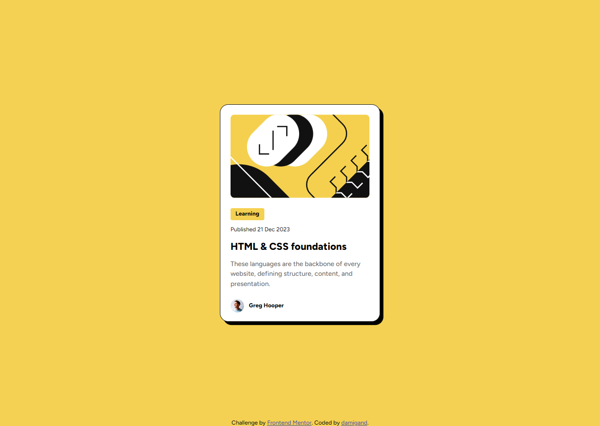

# Frontend Mentor - Blog preview card solution

This is a solution to the
[Blog preview card challenge on Frontend Mentor](https://www.frontendmentor.io/challenges/blog-preview-card-ckPaj01IcS). Frontend Mentor
challenges help you improve your coding skills by building realistic projects.

## Table of contents

-   [Overview](#overview)
    -   [Screenshot](#screenshot)
    -   [Links](#links)
-   [My process](#my-process)
    -   [Built with](#built-with)
    -   [What I learned](#what-i-learned)
    -   [Continued development](#continued-development)
    -   [Useful resources](#useful-resources)
-   [Author](#author)

**Note: Delete this note and update the table of contents based on what sections you keep.**

## Overview

### Screenshot



### Links

-   Solution URL: [Add solution URL here](https://your-solution-url.com)
-   Live Site URL: [Add live site URL here](https://your-live-site-url.com)

## My process

### Built with

-   Semantic HTML5 markup
-   CSS custom properties
-   Flexbox
-   Desktop-first workflow

### What I learned

I had no idea how the CSS property `object-fit` worked. I had to do a little bit of trial and error until I finally realized that
`object-fit: cover;` works only with a specified width. I had to make sure the image's height didn't shrink or expand or else the card would
look screwed. So it looks like this:

```css
.card > img {
    border-radius: 10px;
    width: 100%;
    min-height: 200px;
    object-fit: cover;
}
```

### Continued development

I don't think I fully understand how the CSS property `object-fit` works yet, but I'll eventually get the hang of it.

### Useful resources

-   ["object-fit" property - W3Schools](https://www.w3schools.com/css/css3_object-fit.asp) - This helped me get the desired image behaviour
    within the card using the `object-fit` property.

## Author

-   Frontend Mentor - [damigand](https://www.frontendmentor.io/profile/damigand)
-   GitHub - [damigand](https://www.github.com/damigand)
